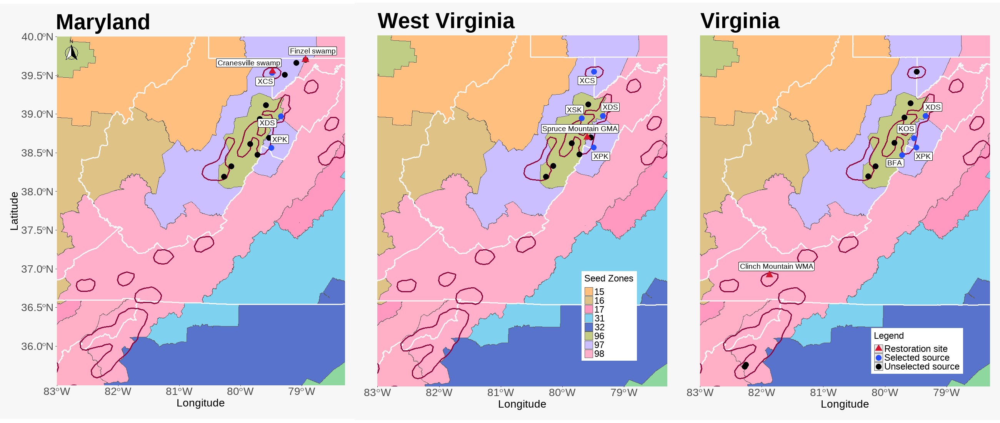
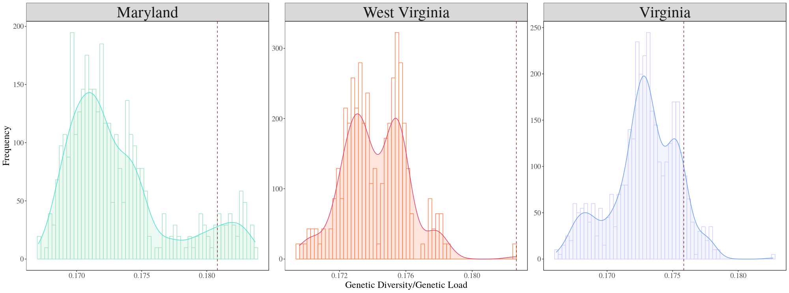

--- 
title: "Bringing genomics to the field: an integrative approach to forest restoration"
author: "Anoob Prakash"
date: "`r Sys.Date()`"
site: bookdown::bookdown_site
documentclass: book
bibliography: [book.bib, packages.bib]
# url: your book url like https://bookdown.org/yihui/bookdown
# cover-image: path to the social sharing image like images/cover.jpg
description: |
  This is the documentation of the analysis done for the manuscript titled "Bringing genomics to the field: an integrative approach to forest restoration".
link-citations: yes
github-repo: rstudio/bookdown-demo
suppress-bibliography: false
---

# About {-}

  

::: {.rmdimportant}
**Bringing genomics to the field: An integrative approach to forest restoration**  
*Anoob Prakash, Thibaut Capblancq, Kathryn Shallows, Dave Seville, Deborah Landau, Chad Landress, Tal Jacobs and Stephen Keller*  

:::


_Climate change and anthropogenic land use are increasingly threatening the health and productivity of natural forest ecosystems. Assisted migration and reforestation are important tools to help mitigate these impacts, with recent calls for large-scale tree planting campaigns to help offset climate change. However, important questions remain about how best to source restoration seeds to ensure vigorous establishment and future adaptability. An often unaddressed issue is how to strategically sample the local gene pool to maximally capture standing genetic diversity while also avoiding the genetic load of deleterious mutations. Importantly, this optimization of diversity while minimizing load should explicitly take into account  local adaptation to avoid outbreeding depression with the planting site. The benefits of this three-part strategy (diversity-load-adaptation) are to increase early-life fitness at planting, while also boosting the evolutionary potential to respond to future stressors. We provide a case study of our approach based on the forest tree red spruce (Picea rubens)._   


```{r,echo=F, out.width = '100%'}

```


_Using published exome-capture sequencing, we first demonstrate a computational approach to finding the best n-sets from a candidate list of source populations local to the region of reforestation that collectively achieve high diversity and minimal load. Three different best n-sets of sources were then selected for collection and propagation, corresponding to target restoration sites in Maryland, Virginia and West Virginia of importance to the Nature Conservancy (TNC) and the Central Appalachian Spruce Restoration Initiative (CASRI). After 1 year of propagation under greenhouse conditions, TNC and CASRI planted 58,000 of these seedlings across 3 sites, totalling 255 acres. A subset of seedlings at each site were monitored 1 year later for establishment success. Our study shows the potential for integrating genomics into local-scale restoration, and the importance of building partnerships between academic researchers and applied conservation managers._  


```{r include=FALSE}
# automatically create a bib database for R packages
knitr::write_bib(c(
  .packages(), 'bookdown', 'knitr', 'rmarkdown'
), 'packages.bib')
```

<!--chapter:end:index.Rmd-->

# (PART\*) Genomic selection of sources  
# Setting up {-} 

Read in the necessary data for the source optimization. [SnpEff v5.1](https://pcingola.github.io/SnpEff/) *(Cingolani et al., 2012)* was used to annotate genetic variants to functional class based on Norway spruce genome annotation. 


## Import annotations from SnpEff {-} 
```{r eval=FALSE}
## working directory 
setwd("~/mydata/Anoob/TNC")

list <- list.files(path = "../../datashare/Spruce/exome_capture/WES_mapping/Annotations/ref_Pglauca/VCF_split_files", 
                   pattern = "Red_Spruce_intersect_poly_", recursive=TRUE, full.names = T)

genes <- lapply(list[1], function(x) read.table(x))
category <- lapply(genes, function(x) unlist(lapply(strsplit(as.character(x[,8]), split = "|", fixed = T), function(y) y[2])))

TAB <- genes[1:2]
TAB <- do.call(rbind, TAB)
category <- do.call(c, category)
```

Read in the meta data for the samples.   
```{r eval=FALSE}
# Info samples
names <- unlist(lapply(strsplit(unlist(strsplit(as.character(read.table("all_bam.list")[,1]), split = "_rmdup.sorted.bam")), split = "./"), function(x) x[2]))
pops <- unlist(lapply(strsplit(names, split="_"), function(x) x[1]))

info_inds <- read.table("./Info_samples_revised.txt", header=T)
info_inds <- info_inds[match(as.character(names), as.character(info_inds$Family)),]
info_pops <- info_inds[!duplicated(info_inds$Site),-c(1,3,9,10)]
```

## Allele probabilities and frequencies   {-} 
```{r eval=FALSE}
# Read depth 
depth <- apply(TAB[,-c(1:9)], 2, function(x) as.integer(unlist(lapply(strsplit(as.character(x), split = ":"), function(y) y[2]))))

# Genotype probabilities, changed by NA for the uncovered sites 
gen_prob <- apply(TAB[,-c(1:9)], 2, function(x) unlist(lapply(strsplit(as.character(x), split = ":"), function(y) y[4])))
gen_prob[which(depth==0)] <- NA

# Proba alternative allele
altern_proba <- apply(gen_prob, 2, function(x) (as.numeric(unlist(lapply(strsplit(as.character(x), split = ","), function(y) y[2])))+2*as.numeric(unlist(lapply(strsplit(as.character(x), split = ","), function(z) z[3]))))/2)

# Frequency of the alternative allele for each locus and population
TAB_pop <- lapply(unique(pops), function(x) altern_proba[,which(pops==x)])
names(TAB_pop) <- unique(pops)
freq_pop <- lapply(TAB_pop, function(x) apply(x, 1, function(y) sum(y, na.rm = T)/sum(!is.na(y))))
```

<!--chapter:end:1.1-setting_up_gd-gl_workflow.Rmd-->

# Funtions to optimize selection {-} 

## Select regions to select sources   {-} 
Based on the idea of ***Regional admixture provenancing*** (citation), seed sources were selected regionally for each restoration site. Three groups of source populations were subsetted for the three planting sites, removing XVC and HR because of their northern ancestry. More info on the regional ancestry detailed in (citation).  
```{r eval=FALSE}
# Sources considered for the Maryland restoration site 
TAB_pop_maryland <- TAB_pop[which(names(TAB_pop)%in%info_pops$Site[which(info_pops$Region=="E" & !info_pops$State%in%c("NC","TN") & !info_pops$Site%in%c("XCV","HR"))])]

# Sources considered for the West Virginia restoration site
TAB_pop_westvirginia <- TAB_pop[which(names(TAB_pop)%in%info_pops$Site[which(info_pops$Region=="E" & info_pops$State=="WV" & !info_pops$Site%in%c("XCV","HR"))])]

# Sources considered for the Virginia restoration site
TAB_pop_virginia <- TAB_pop[which(names(TAB_pop)%in%info_pops$Site[which(info_pops$Region=="E" & (info_pops$State=="WV" & !info_pops$Site%in%c("XCV") | info_pops$Site%in%c("GMF","CR","DG","RP")))])] # remove HR and CV for the paper
```

## Optimizing genetic diversity  {-} 
```{r eval=FALSE}
# function to estimate allelic richness after rarefaction
rarefy_AR <- function(data, g, bootstraping=100){
  Nijg <- list()
  Njg <- g*2
  nbind <- ncol(data)
  Nij <- list()
  for(boot in 1:bootstraping){
    inds <- sample(1:nbind, g, replace = FALSE)
    if(g==1){
      Nij[[boot]] <- data[,inds]*2}
    if(g>1){
      Nij[[boot]] <- apply(data[,inds], 1, function(x) sum(x, na.rm = T)/sum(!is.na(x)))*g*2}
  }
  Nijg <- rowMeans(do.call(cbind, Nij), na.rm = T)
  Qijg <- (Njg-Nijg)/Njg
  Pijg <- 1-Qijg
  return(Pijg)
}
```

## Estimate the genetic load   {-} 
The following function is used to estiamte the ratio of nonsynonymous/synonymous mutation based on the annotation from [SnpEff v5.1](https://pcingola.github.io/SnpEff/) *(Cingolani et al., 2012)*, which was used to annotate genetic variants to functional class based on Norway spruce genome annotation. The functional categories *viz.* `missense variant, splice acceptor variant, splice donor variant, splice region variant, start lost, stop gained, stop lost` were used to designate as non-synonymous mutation in our calculation for genetic load.
```{r eval=FALSE}
genetic_load <- function(data, category){
  nonsyn_sites <- which(category=="missense_variant" | category=="splice_acceptor_variant" | category=="splice_donor_variant" | category=="splice_region_variant" | category=="start_lost" | category=="stop_gained" | category=="stop_lost")
  freq_nonsyn <- mean(data[nonsyn_sites], na.rm = T)
  freq_syn <- mean(data[-nonsyn_sites], na.rm = T)
  ratio_2 <- freq_nonsyn/freq_syn
  return(ratio_2)
}
```

## Combined function to optimize source combinations  {-}  
This function combines the rarefy_AR and genetic_load function to estimate expected heterozygosity (Hexp), allelic richness and genetic load in all combinations of ***P*** populations. The ***P*** depends on the number of sources one decides to select for their restoration site. 
```{r eval=FALSE}
# function to estimate Hexp, Allelic Richness and Genetic Load in all combination of P populations
optimize <- function(data, P){
  
  # Total diversity and load with all the populations
  TAB_tot <- do.call(cbind,data)
  freq_tot <- apply(TAB_tot, 1, function(y) sum(y, na.rm = T)/sum(!is.na(y)))
  hexp_tot <- mean(2*freq_tot*(1-freq_tot), na.rm = T)
  #all_rich_tot <- mean(rarefy_AR(TAB_tot, ncol(TAB_tot)), na.rm = T)
  genetic_load_tot <- genetic_load(TAB_tot, category)
  
  # Genetic diversity and load with only a subset of P populations
  hexp_sub <- list()
 
  genetic_load_sub <- list()
  names <- list()
  comb <- combn(1:length(data), P, simplify = F)
  for(i in 1:length(comb)){
    TAB_sub <- do.call(cbind, data[comb[[i]]])
    freq_sub <- apply(TAB_sub, 1, function(y) sum(y, na.rm = T)/sum(!is.na(y)))
    hexp_sub[i] <- mean(2*freq_sub*(1-freq_sub), na.rm = T)
    
    genetic_load_sub[i] <- genetic_load(TAB_sub, category)
    names[i] <- paste(names(data[comb[[i]]]), collapse="_")
  }
  TAB_sub <- do.call(rbind, lapply(1:length(hexp_sub), function(x) c(Hexp = hexp_sub[[x]], GenLoad = genetic_load_sub[[x]]))) #AllRich = all_rich_sub[[x]], 
  TAB <- rbind(c(Hexp = hexp_tot, GenLoad = genetic_load_tot), TAB_sub) #AllRich = all_rich_tot, 
  rownames(TAB) <- c("total", unlist(names))
  
  return(TAB)
}
```

## Apply the function to get optimal source combinations {-} 
```{r eval=FALSE}
# Optimization sources for site in Maryland
res_maryland <- optimize(TAB_pop_maryland, 3)
which.max(res_maryland[-1,1]/res_maryland[-1,2])
res_maryland[c(1,which.max(res_maryland[-1,1]/res_maryland[-1,2])+1),]

# Optimization sources for site in West Virginia
res_westvirginia_4 <- optimize(TAB_pop_westvirginia, 4)
which.max(res_westvirginia_4[-1,1]/res_westvirginia_4[-1,2])

# Optimization sources for site in Virginia
res_virginia_4 <- optimize(TAB_pop_virginia, 4)
which.max(res_virginia_4[-1,1]/res_virginia_4[-1,2])

```

<!--chapter:end:1.2-function_to_estimate_gd-gl.Rmd-->

# Factors affecting source selection {-} 

Even though the optimal source combinations are obtained from the optimize function for each site. Its just a list of recommendations for the restoration practitioners to select from. The final source combination selected depends on the seed availabiity during the year of procurement.  

## Plotting with base R   {-} 
```{r, eval=F}
# plots

## MD
hist(res_maryland[,1])
res_maryland["XCS_XDS_XPK",1] #0.1738237
abline(v=0.1738237)

## WV
hist(res_westvirginia_4[,1]/res_westvirginia_4[,2])
which.max(res_westvirginia_4[-1,1]/res_westvirginia_4[-1,2]) # the combination chosen for WV
res_westvirginia_4["XCS_XDS_XPK_XSK",1]/res_westvirginia_4["XCS_XDS_XPK_XSK",2] 
abline(v=0.1826622, col="red")

## VA

hist(res_virginia_4[-1,1]/res_virginia_4[-1,2])
res_virginia_4["BFA_KOS_XDS_XPK",1]/res_virginia_4["BFA_KOS_XDS_XPK",2] # 0.1758529
abline(v=0.1758529)

```

## Plotting with ggplot2   {-} 
```{r, eval=F}
# Plots for APPS ----------------------------------------------------------
require(ggplot2)

# Maryland final
MD_data <- as.data.frame(res_maryland[,1]/res_maryland[,2])
colnames(MD_data)[1] <- "GD_GL"
MD_data$Sources <- rownames(MD_data)
rownames(MD_data) <- NULL
MD_data <- MD_data[-1,]

MD_plot <-    ggplot(MD_data, aes(x=GD_GL)) +
              geom_histogram(aes(y=..density..),color="#9FE2BF",fill="white", position="dodge", bins=60)+
              geom_density(alpha=.2, fill="#9FE2BF", color="#DFFF00") +
              geom_vline(aes(xintercept=res_maryland["XCS_XDS_XPK",1]/res_maryland["XCS_XDS_XPK",2]),
                         linetype="dashed", color="#7B241C")+
              theme(legend.position="top")

plot1 <- MD_plot + scale_color_brewer(palette="Dark2") +
          theme_minimal()+theme_classic()+theme(legend.position="top") +
          ylab("Frequency") + xlab("Genetic Diversity/Genetic Load") + 
          theme_bw(base_size = 11, base_family = "Times") +
          theme(axis.text=element_text(size=14), 
                axis.title=element_text(size=18),
                panel.background = element_blank(), 
                legend.background = element_blank(), 
                panel.grid = element_blank(), 
                plot.background = element_blank(), 
                legend.text=element_text(size=rel(.8)), 
                strip.text = element_text(size=30),
                legend.position = "none")


# West Virginia
WV_data <- as.data.frame(res_westvirginia_4[,1]/res_westvirginia_4[,2])
colnames(WV_data)[1] <- "GD_GL"
WV_data$Sources <- rownames(WV_data)
rownames(WV_data) <- NULL
WV_data <- WV_data[-1,]

WV_plot <-    ggplot(WV_data, aes(x=GD_GL)) +
  geom_histogram(aes(y=..density..),color="#FF7F50",fill="white", position="dodge", bins=60)+
  geom_density(alpha=.2, fill="#FF7F50", color="#FFBF00") +
  geom_vline(aes(xintercept=res_westvirginia_4["XCS_XDS_XPK_XSK",1]/res_westvirginia_4["XCS_XDS_XPK_XSK",2]),
             linetype="dashed", color="#7B241C")+
  theme(legend.position="top")

plot2 <- WV_plot + scale_color_brewer(palette="Dark2") +
          theme_minimal()+theme_classic()+theme(legend.position="top") +
          ylab("Frequency") + xlab("Genetic Diversity/Genetic Load") + 
          theme_bw(base_size = 11, base_family = "Times") +
          theme(axis.text=element_text(size=14), 
                axis.title=element_text(size=18),
                panel.background = element_blank(), 
                legend.background = element_blank(), 
                panel.grid = element_blank(), 
                plot.background = element_blank(), 
                legend.text=element_text(size=rel(.8)), 
                strip.text = element_text(size=30),
                legend.position = "none")


# Virginia
VA_data <- as.data.frame(res_virginia_4[,1]/res_virginia_4[,2])
colnames(VA_data)[1] <- "GD_GL"
VA_data$Sources <- rownames(VA_data)
rownames(VA_data) <- NULL
VA_data <- VA_data[-1,]

VA_plot <-    ggplot(VA_data, aes(x=GD_GL)) +
  geom_histogram(aes(y=..density..),color="#CCCCFF",fill="white", position="dodge", bins=60)+
  geom_density(alpha=.2, fill="#CCCCFF", color="#6495ED") +
  geom_vline(aes(xintercept=res_virginia_4["BFA_KOS_XDS_XPK",1]/res_virginia_4["BFA_KOS_XDS_XPK",2]),
             linetype="dashed", color="#7B241C")+
  theme(legend.position="top")

plot3 <- VA_plot + scale_color_brewer(palette="Dark2") +
          theme_minimal()+theme_classic()+theme(legend.position="top") +
          ylab("Frequency") + xlab("Genetic Diversity/Genetic Load") + 
          theme_bw(base_size = 11, base_family = "Times") +
          theme(axis.text=element_text(size=14), 
                axis.title=element_text(size=18),
                panel.background = element_blank(), 
                legend.background = element_blank(), 
                panel.grid = element_blank(), 
                plot.background = element_blank(), 
                legend.text=element_text(size=rel(.8)), 
                strip.text = element_text(size=30),
                legend.position = "none")


# convert to long data
MD_data2 <- MD_data
MD_data2$Plot <- "Maryland"
WV_data2 <- WV_data
WV_data2$Plot <- "West Virginia"
VA_data2 <- VA_data
VA_data2$Plot <- "Virginia"


GDGL_long_dat <- rbind(MD_data2,WV_data2,VA_data2)
GDGL_long_dat$Plot <- factor(GDGL_long_dat$Plot,levels=c("Maryland","West Virginia","Virginia"))
```

GD/GL plot across sites 
```{r, eval=F}
# 
# figure dim: png(2000h,769w), pdf(7h,18w)
GDGL_plot <- ggplot(GDGL_long_dat, aes(x=GD_GL,color=Plot,fill=Plot)) + facet_wrap(~Plot, scales="free") + 
                # add histogram
                geom_histogram(data=filter(GDGL_long_dat, Plot=="Maryland"), aes(y=..density..),color="#9FE2BF",fill="white", position="dodge", bins=60)+
                geom_histogram(data=filter(GDGL_long_dat, Plot=="West Virginia"), aes(y=..density..),color="#FF7F50",fill="white", position="dodge", bins=60)+
                geom_histogram(data=filter(GDGL_long_dat, Plot=="Virginia"), aes(y=..density..),color="#CCCCFF",fill="white", position="dodge", bins=60)+
                
                # add geom_density
                geom_density(data=filter(GDGL_long_dat, Plot=="Maryland"), alpha=.2, fill="#9FE2BF", color="#40E0D0") + 
                geom_density(data=filter(GDGL_long_dat, Plot=="West Virginia"), alpha=.2, fill="#FF7F50", color="#DE3163") + 
                geom_density(data=filter(GDGL_long_dat, Plot=="Virginia"), alpha=.2, fill="#CCCCFF", color="#6495ED") +
                
                # add vline
                geom_vline(data=filter(GDGL_long_dat, Plot=="Maryland"), 
                           aes(xintercept=res_maryland["XCS_XDS_XPK",1]/res_maryland["XCS_XDS_XPK",2]),
                           linetype="dashed", color="#7B241C") + 
                geom_vline(data=filter(GDGL_long_dat, Plot=="West Virginia"), 
                           aes(xintercept=res_westvirginia_4["XCS_XDS_XPK_XSK",1]/res_westvirginia_4["XCS_XDS_XPK_XSK",2]),
                           linetype="dashed", color="#7B241C") + 
                geom_vline(data=filter(GDGL_long_dat, Plot=="Virginia"), 
                           aes(xintercept=res_virginia_4["BFA_KOS_XDS_XPK",1]/res_virginia_4["BFA_KOS_XDS_XPK",2]),
                           linetype="dashed", color="#7B241C") +
                # theme
                theme_minimal()+theme_classic()+theme(legend.position="top") +
                ylab("Frequency") + xlab("Genetic Diversity/Genetic Load") + 
                theme_bw(base_size = 11, base_family = "Times") +
                theme(axis.text=element_text(size=14), 
                      axis.title=element_text(size=18),
                      panel.background = element_blank(), 
                      legend.background = element_blank(), 
                      panel.grid = element_blank(), 
                      plot.background = element_blank(), 
                      legend.text=element_text(size=rel(.8)), 
                      strip.text = element_text(size=30),
                      legend.position = "none")

GDGL_plot
```

```{r,echo=F, out.width = '100%'}

```


<!--chapter:end:1.3-find_source_combos_gd-gl.Rmd-->

# Save data for downstream analysis  {-}

## Creating the GD/GL list {-}
```{r, eval=F}
# save data for further analysis
MD_reg_GDGL <- as.data.frame(res_maryland)
MD_reg_GDGL$GDGL <- MD_reg_GDGL$Hexp/MD_reg_GDGL$GenLoad

WV_reg_GDGL <- as.data.frame(res_westvirginia_4)
WV_reg_GDGL$GDGL <- WV_reg_GDGL$Hexp/WV_reg_GDGL$GenLoad

VA_reg_GDGL <- as.data.frame(res_virginia_4)
VA_reg_GDGL$GDGL <- VA_reg_GDGL$Hexp/VA_reg_GDGL$GenLoad

GDGL_list <- list()
GDGL_list[[1]] <- MD_reg_GDGL
GDGL_list[[2]] <- WV_reg_GDGL
GDGL_list[[3]] <- VA_reg_GDGL

names(GDGL_list) <- c("Maryland_GDGL","West_Virginia_GDGL","Virginia_GDGL")

# saveRDS(GDGL_list, "./OUTPUT/Genetic_diversity_and_Genetic_load/GDGL_list")
```


## For source selection maps {-}

```{r, eval=F}
MarylandSources <- tail(sort(res_maryland[-1,1]/res_maryland[-1,2]),50)
MarylandSources <- as.data.frame(MarylandSources)
MarylandSources[2] <- rownames(MarylandSources)
rownames(MarylandSources) <- NULL
colnames(MarylandSources)[2] <- "Source_combination"
colnames(MarylandSources)[1] <- "GD/GL"

VirginiaSources <- tail(sort(res_virginia_4[-1,1]/res_virginia_4[-1,2]),50)
VirginiaSources <- as.data.frame(VirginiaSources)
VirginiaSources[2] <- rownames(VirginiaSources)
rownames(VirginiaSources) <- NULL
colnames(VirginiaSources)[2] <- "Source_combination"
colnames(VirginiaSources)[1] <- "GD/GL"


WestVirginiaSources <- tail(sort(res_westvirginia_4[-1,1]/res_westvirginia_4[-1,2]),50)
WestVirginiaSources <- as.data.frame(WestVirginiaSources)
WestVirginiaSources[2] <- rownames(WestVirginiaSources)
rownames(WestVirginiaSources) <- NULL
colnames(WestVirginiaSources)[2] <- "Source_combination"
colnames(WestVirginiaSources)[1] <- "GD/GL"

# write.csv(MarylandSources,"./OUTPUT/MarylandSources_selected_top50.csv")
# write.csv(VirginiaSources,"./OUTPUT/VirginiaSources_selected_top50.csv")
# write.csv(WestVirginiaSources,"./OUTPUT/WestVirginiaSources_selected_top50.csv")
```

## Estimate genetic load and genetic diversity of each pops {-}
```{r, eval=F}

# Optimization sources for site in Maryland
res_maryland_singular <- optimize(TAB_pop_maryland, 1)
which.max(res_maryland_singular[-1,1]/res_maryland_singular[-1,2])
res_maryland_singular[c(1,which.max(res_maryland_singular[-1,1]/res_maryland_singular[-1,2])+1),]

# write.csv(res_maryland_singular, "./OUTPUT/Genetic_diversity_and_Genetic_load/maryland_GDGL_per_source")

# Optimization sources for site in West Virginia
res_westvirginia_singular <- optimize(TAB_pop_westvirginia, 1)
which.max(res_westvirginia_singular[-1,1]/res_westvirginia_singular[-1,2])
res_westvirginia_singular[c(1,which.max(res_westvirginia_singular[-1,1]/res_westvirginia_singular[-1,2])+1),]

# write.csv(res_westvirginia_singular, "./OUTPUT/Genetic_diversity_and_Genetic_load/west_virginia_GDGL_per_source")

# Optimization sources for site in Virginia
res_virginia_singular <- optimize(TAB_pop_virginia, 1)
which.max(res_virginia_singular[-1,1]/res_virginia_singular[-1,2])
res_virginia_singular[c(1,which.max(res_virginia_singular[-1,1]/res_virginia_singular[-1,2])+1),]

# write.csv(res_virginia_singular, "./OUTPUT/Genetic_diversity_and_Genetic_load/virginia_GDGL_per_source")

# full sets of pops
TAB_pop_full <- TAB_pop[which(names(TAB_pop)%in%info_pops$Site[which(info_pops$Region=="E" & !info_pops$Site%in%c("XCV","HR"))])]

res_pop_full_singular <- optimize(TAB_pop_full, 1)
which.max(res_pop_full_singular[-1,1]/res_pop_full_singular[-1,2])
res_pop_full_singular[c(1,which.max(res_pop_full_singular[-1,1]/res_pop_full_singular[-1,2])+1),]
```


<!--chapter:end:1.4-data_for_downsteam_analysis_gd-gl.Rmd-->

